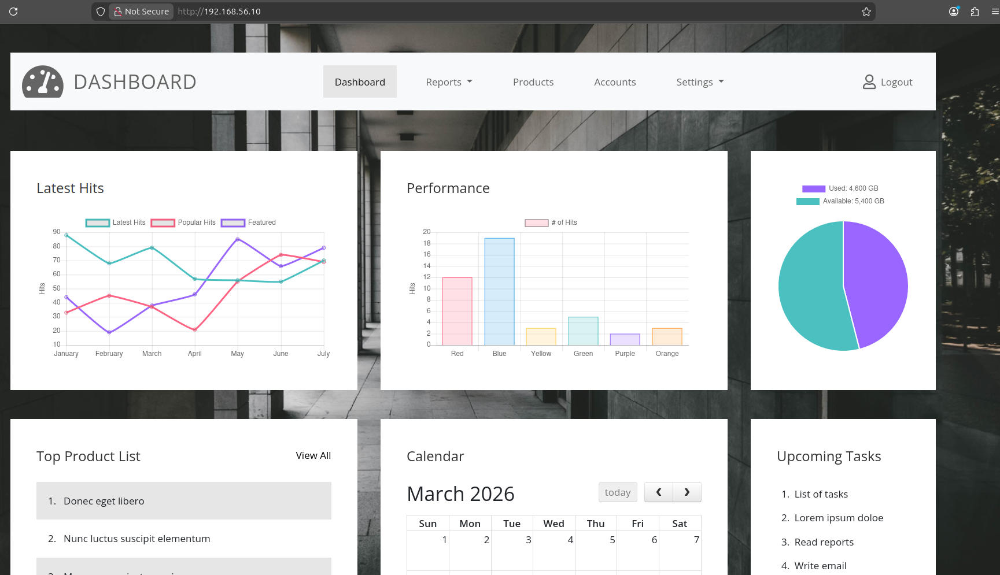

# Deploying a Dashboard Website on CentOS Using HTTP Server with Vagrant

## Overview
This guide walks through setting up a basic web server on CentOS using Vagrant and automatically deploying a dashboard website template via HTTP.

## Prerequisites
- Vagrant installed on your machine
- VirtualBox or another Vagrant-compatible hypervisor
- Basic knowledge of command line and web servers

## Steps

### 1. Configure Vagrantfile
The `Vagrantfile` is pre-configured with:
- CentOS Stream 9 box
- Private network IP: 192.168.56.10
- 1GB RAM allocation
- Automated provisioning script that installs Apache HTTP Server, downloads and deploys a dashboard template

### 2. Start the Virtual Machine and Provision
Run the following command to start the VM and automatically provision the server:
```bash
vagrant up
```

This will:
- Boot the CentOS VM
- Install and start Apache HTTP Server
- Download the dashboard template from Tooplate
- Extract it to `/var/www/html/`

### 3. Access the Website
Once provisioning is complete, access your deployed dashboard website at `http://192.168.56.10` in your browser.
### 4. List of steps and commands
```bash
sudo yum install httpd unzip zip -y
```
```bash
sudo systemctl start httpd
```
```bash
sudo systemctl enable httpd
```
```bash
mkdir -p /tmp/website; cd /tmp/website 
```
```bash
mkdir -p /tmp/website;
```
```bash
cd /tmp/website 
```
```bash
wget https://www.tooplate.com/zip-templates/2108_dashboard.zip
```
```bash
unzip -o 2108_dashboard.zip
```
```bash
cp -r 2108_dashboard/* /var/www/html/
```

```bash
 systemctl restart httpd
```
```bash
 cd /tmp
```
```bash
 rm -rf /tmp/website
```
## Conclusion
Your dashboard website is now running on CentOS with Apache HTTP Server via Vagrant, fully automated through provisioning.
<hr>

# Screenshoot

Admin Panel Website</img>
<hr>

# VideoRecorded

<video width="320" height="240" controls>
    <source src="video.webm" type="video/webm">
    Seu navegador não suporta o elemento de vídeo.
</video>